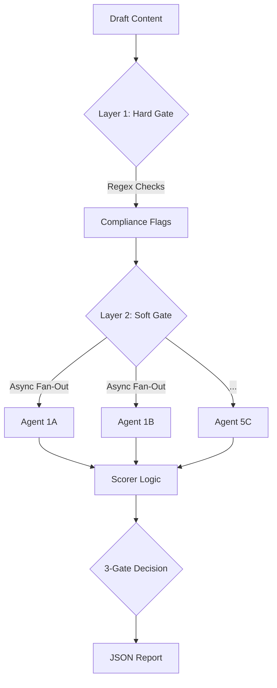

Here is the updated **Design Specification**, revised to match the finalized PRD, the Granular Parallel Architecture (18 agents), and the specific Layer 1 Regex strategy.

-----

# AI Content Scoring Agent: Design Specification v2.0

## 1.0 Introduction & Philosophy

### 1.1 The Challenge

When scaling content production using AI, the primary risk is mediocrity. AI models naturally regress to the mean, producing generic, "corporate-sounding" output. For **monday.com**, a challenger brand in the CRM market, "safe" or "boring" content is a failure state. The brand requires content that is confident, spicy, witty, and fluff-free.

### 1.2 The Solution

We propose a locally hosted, **Hybrid Discriminative AI System** designed to act as an automated quality control layer. Unlike standard "evals" that use a single prompt, this system utilizes a **Granular Parallel Architecture**, breaking content evaluation down into **19 isolated sub-parameters** to ensure maximum objectivity.

### 1.3 Core Principles

  * **Objectivity by Isolation:** We eliminate the "Halo Effect" (where good grammar inflates strategy scores) by using 18 separate, asynchronous LLM calls. Each agent evaluates *only* one specific criteria (e.g., "Did this use passive voice?") without knowledge of the other scores.
  * **Determinism First (Layer 1):** We do not waste tokens asking an LLM to check spelling or capitalization. A rigorous Python Regex layer handles strict compliance (e.g., `monday.com` lowercase) with 100% accuracy before the AI is ever invoked.
  * **The "Boredom Penalty":** The scoring system is weighted to heavily penalize generic, "safe" content.
  * **Forced Choice Scoring:** We employ a 1-4 ordinal scale (`temperature=0`) to force the model to make a clear decision, eliminating the noise of 1-10 scales.

## 2.0 Scoring Logic

### 2.1 The 5 Parameters & 19 Sub-Parameters

The agent evaluates content across 5 weighted parameters. The weights have been strategically adjusted to prioritize **Voice** (differentiation) and **Clarity** (BLUF/Time-to-value).

| Parameter | Weight | Sub-Parameters (The "Granular" Check) |
| :--- | :--- | :--- |
| **1. Challenger Tone & Voice** | **30%** | **1B Direct/Personality (10%)**, **1D Sharp Wit (10%)**, 1A Positive/Solution-Focused (5%), 1C Trustworthy (5%).  *Goal: The "Spiciness" factor. Penalizes robotic/corporate tone.* |
| **2. Structural Integrity & Clarity** | **25%** | **3A BLUF (10%)**, **3C Conciseness (5%)**, **3E Human Language (5%)**, 3B Scannability (3%), 3D Specificity (2%).  *Goal: Ensures Bottom Line Up Front and fluff-free writing.* |
| **3. Brand Hygiene & Compliance** | **20%** | **2B Contextual Terminology (10%)** (LLM), 2A Mechanical Compliance (5%) (Regex), 2C Persona/Lexicon (5%) (LLM).  *Goal: Non-negotiable style guide adherence (e.g., "Customer" not "User").* |
| **4. Strategic Value & Depth** | **15%** | **4B Actionability (5%)**, **4D Originality/AI Detection (5%)**, 4A Audience Alignment (3%), 4C Evidence (2%).  *Goal: Combats generic AI output by demanding concrete takeaways.* |
| **5. Engagement & Discoverability** | **10%** | **5A Headline & Hook (5%)**, 5B SEO Alignment (3%), 5C Shareability (2%).  *Goal: Immediate attention capture.* |

### 2.2 Scoring Scale (1-4 Forced Choice)

We utilize a 1-4 ordinal scale to turn evaluation into a classification problem rather than a regression problem.

| Score | Label | Description |
| :--- | :--- | :--- |
| **1** | **Critical Fail** | Active brand violation (e.g., using "Tool" to describe monday), toxic tone, or factually incorrect. |
| **2** | **Generic (Mediocre)** | Grammatically correct but boring. Sounds like generic AI output ("Gray Goo"). Lacks opinion or wit. |
| **3** | **Publishable Standard** | Clear, helpful, professional. Follows Style Guide. Meets the "Human" standard. |
| **4** | **Challenger Status** | Exceptional. Unique insight, witty, distinct voice, zero fluff. Exceeds expectations. |

## 3.0 Implementation & Architecture

### 3.1 System Architecture: Two-Layer Hybrid

The system uses a "Hard Gate / Soft Gate" approach to maximize efficiency and accuracy.

### 3.2 Layer 1: The Hard Gate (Deterministic Regex)

  * **Technology:** Python `re` module.
  * **Function:** Instant, zero-cost checks for binary mechanical errors. If a violation is found here, the "Brand Hygiene" score is penalized, and the specific text is flagged for correction.
  * **Specific Checks (per `src/regex_checker.py`):**
      * **Brand Naming:** Enforces `monday.com` (always lowercase).
      * **Forbidden Terms:** Blocks "sub-tasks" (must be sub-items), "percent" (must be %), "synergy," "uplevel."
      * **Localization:** Enforces American English (blocks "colour," "organise").
      * **Formatting:** Checks for Oxford Comma and proper Em-dash usage.

### 3.3 Layer 2: The Soft Gate (Granular Parallel LLM)

  * **Technology:** `Asyncio` + LLM API (e.g., Claude 3.5 Sonnet/GPT-4o).
  * **Architecture:** Asynchronous Fan-Out.
  * **Operation:** The system triggers **18 simultaneous API calls**.
  * **Rationale:** By isolating sub-parameters (e.g., Agent 3A checks *only* BLUF; Agent 1B checks *only* Wit), we prevent the model from getting confused or lazy.

### 3.4 Key Agent Logic (Advanced Prompt Engineering)

#### A. The "Tool" Paradox (Agent 2B - Contextual Terminology)

Simple regex cannot handle the rule "Don't call monday.com a tool."

  * **Logic:** The LLM is prompted to identify every instance of the word "Tool" or "Hub."
  * **Decision Tree:**
      * Is the subject monday.com? -\> **Violation (Critical)**.
      * Is the subject a competitor or general concept? -\> **Pass**.

#### B. BLUF Validation (Agent 3A - Chain of Thought)

To validate "Bottom Line Up Front," the agent must understand the conclusion first.

  * **Prompt Sequence:**
    1.  Read the Body and Conclusion. Summarize the core insight.
    2.  Read the Introduction (First 2 paragraphs).
    3.  **Comparison:** Is the insight from Step 1 explicitly stated in Step 2?
    4.  **Score:** High if yes, Low if the intro is vague or "teasing."

## 4.0 Training & Calibration

To ensure the "3.2" threshold is meaningful, we employ a comparative calibration strategy.

1.  **The Golden Set:** 5-10 human-verified, high-performing monday.com blog posts. (Target System Score: \> 3.5).
2.  **The Poison Set:** 5-10 generic, AI-generated posts created with standard prompts. (Target System Score: \< 2.5).
3.  **Tuning:** If the Poison Set scores too high, we tighten the prompt instructions for "Conciseness" and "Wit" until the scores drop.

## 5.0 The "Publish-Ready" Definition

We define "Publish-Ready" using a **3-Gate System**. Content must pass **all three gates** to receive a `true` status in the JSON output.

1.  ✅ **Gate 1: Overall Weighted Score ≥ 3.2** (Ensures general high quality).
2.  ✅ **Gate 2: Tone Veto (P1 ≥ 3.0)** (The "Boredom Penalty" — if the tone is generic/robotic, the piece fails regardless of accuracy).
3.  ✅ **Gate 3: Brand Veto (Zero Critical Violations)** (Content cannot be published if Layer 1 or Agent 2B flags a critical violation like "Monday.com" capitalized or "Tool" usage).

## 6.0 Output & Reporting

The system generates a detailed JSON report (`report.json`) containing:

  * **Metadata:** Timestamp, Content ID.
  * **Executive Summary:** Final Score, Publish-Ready Status (Bool), Gate Status.
  * **Granular Breakdown:** Nested scores for all 19 sub-parameters with specific feedback strings.
  * **Flags:** A list of specific text snippets (from Layer 1 and Layer 2) that require manual correction.