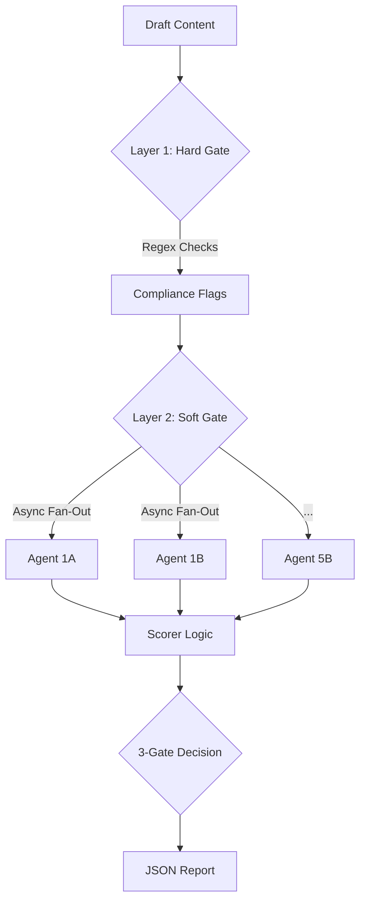

Here is the updated **Design Specification**, revised to match the finalized PRD v6.0, the Granular Parallel Architecture (16 agents), and the specific Layer 1 Regex strategy.

-----

# AI Content Scoring Agent: Design Specification v2.0

## Executive Summary

**Business Challenge:** As monday.com scales AI-powered content production for monday.com CRM, the primary risk is publishing generic, "safe" content that fails to differentiate monday.com challenger brand in a market dominated by legacy giants.

**Solution:** A hybrid AI scoring system that evaluates content across 5 strategic parameters (17 sub-parameters) using a two-tier architecture: deterministic regex checks for brand compliance + parallel LLM evaluation for voice, clarity, and strategic value. Content must achieve (TBD) overall score AND (TBD) tone score to be publish-ready.

**Expected Outcome:** Scale content production while maintaining monday.com's bold, fluff-free voice—ensuring every published piece reinforces our position as the confident, witty challenger that says what legacy brands won't.

## 1.0 Introduction & Philosophy

### 1.1 The Challenge

When scaling content production using AI, the primary risk is mediocrity. AI models naturally regress to the mean, producing generic, "corporate-sounding" output. For **monday.com**, a challenger brand in the CRM market, "safe" or "boring" content is a failure state. The brand requires content that is confident, spicy, witty, and fluff-free.

### 1.2 The Solution

We propose a locally hosted, **Hybrid Discriminative AI System** designed to act as an automated quality control layer. Unlike standard "evals" that use a single prompt, this system utilizes a **Granular Parallel Architecture**, breaking content evaluation down into **17 isolated sub-parameters** to ensure maximum objectivity.

### 1.3 Core Principles

  * **Objectivity by Isolation:** We eliminate the "Halo Effect" (where good grammar inflates strategy scores) by using 16 separate, asynchronous LLM calls. Each agent evaluates *only* one specific criteria (e.g., "Did this use passive voice?") without knowledge of the other scores.
  * **Determinism First (Layer 1):** We do not waste tokens asking an LLM to check spelling or capitalization. A rigorous Python Regex layer handles strict compliance (e.g., `monday.com` lowercase) with 100% accuracy before the AI is ever invoked.
  * **The "Boredom Penalty":** The scoring system is weighted to heavily penalize generic, "safe" content.
  * **Forced Choice Scoring:** We employ a 1-4 ordinal scale (`temperature=0`) to force the model to make a clear decision, eliminating the noise of 1-10 scales.

## 2.0 Scoring Logic

### 2.1 The 5 Parameters & 17 Sub-Parameters (v6.0)

The agent evaluates content across 5 weighted parameters. The weights have been strategically adjusted to prioritize **Voice** (differentiation) and **Strategic Value** (substance equals style), with **Clarity** (BLUF/Time-to-value) as critical foundation.

| Parameter | Weight | Sub-Parameters (The "Granular" Check) |
| :--- | :--- | :--- |
| **1. Challenger Tone & Voice** | **30%** | **1B Direct/Personality (10%)**, **1D Sharp Wit (10%)**, 1A Positive/Solution-Focused (5%), 1C Trustworthy (5%).  *Goal: The "Spiciness" factor. Penalizes robotic/corporate tone.* |
| **2. Strategic Value & Depth** | **30%** | **4A Audience Alignment (10%)**, **4B Actionability (10%)**, 4C Evidence (5%), 4D Originality/AI Detection (5%).  *Goal: Doubled to ensure substance equals style. Combats generic AI output by demanding concrete takeaways for Sales Leaders.* |
| **3. Structural Integrity & Clarity** | **25%** | **3A BLUF (10%)**, **3C Conciseness & Human Language (5%)**, 3B Scannability (5%), 3D Specificity (5%).  *Goal: Ensures Bottom Line Up Front and fluff-free writing with accessible language.* |
| **4. Engagement & Discoverability** | **10%** | **5A Headline & Hook (5%)**, 5B SEO & Shareability (5%).  *Goal: Immediate attention capture and discoverability.* |
| **5. Brand Hygiene & Compliance** | **5%** | 2A Mechanical Compliance (2%) (Regex), **2B Contextual Terminology (2%)** (LLM), 2C Persona/Lexicon (1%) (LLM).  *Goal: Minimal weight but absolute VETO power (Gate 3). Non-negotiable style guide adherence.* |

### 2.2 Scoring Scale (1-4 Forced Choice)

We utilize a 1-4 ordinal scale to turn evaluation into a classification problem rather than a regression problem.

| Score | Label | Description |
| :--- | :--- | :--- |
| **1** | **Critical Fail** | Active brand violation (e.g., using "Tool" to describe monday), toxic tone, or factually incorrect. |
| **2** | **Generic (Mediocre)** | Grammatically correct but boring. Sounds like generic AI output ("Gray Goo"). Lacks opinion or wit. |
| **3** | **Publishable Standard** | Clear, helpful, professional. Follows Style Guide. Meets the "Human" standard. |
| **4** | **Challenger Status** | Exceptional. Unique insight, witty, distinct voice, zero fluff. Exceeds expectations. |

## 3.0 Implementation & Architecture

**Strategic Rationale:** This two-layer hybrid architecture directly addresses monday.com's core challenge as a challenger brand scaling AI-generated content. The deterministic Layer 1 ensures zero-tolerance brand compliance, while the granular Layer 2 prevents the "mediocrity trap" that plagues AI content at scale. By isolating 17 sub-parameters into parallel API calls (16 LLM agents + 1 regex check), we eliminate scoring bias and maintain the rigorous quality standards required to compete against legacy CRM giants. This architecture enables monday.com to scale content production 10x while maintaining—or exceeding—current quality benchmarks.

### 3.1 System Architecture: Two-Layer Hybrid

The system uses a "Hard Gate / Soft Gate" approach to maximize efficiency and accuracy.

### 3.2 Layer 1: The Hard Gate (Deterministic Regex)

  * **Technology:** Python `re` module.
  * **Function:** Instant, zero-cost checks for binary mechanical errors. If a violation is found here, the "Brand Hygiene" score is penalized, and the specific text is flagged for correction.
  * **Specific Checks (per `src/regex_checker.py`):**
      * **Brand Naming:** Enforces `monday.com` (always lowercase).
      * **Forbidden Terms:** Blocks "sub-tasks" (must be sub-items), "percent" (must be %), "synergy," "uplevel."
      * **Localization:** Enforces American English (blocks "colour," "organise").
      * **Formatting:** Checks for Oxford Comma and proper Em-dash usage.

### 3.3 Layer 2: The Soft Gate (Granular Parallel LLM)

  * **Technology:** `Asyncio` + Claude API
  * **Model:** Claude Sonnet 4.5 (`claude-sonnet-4-5-20250929`)
  * **Architecture:** Asynchronous Fan-Out with conservative rate limiting.
  * **Operation:** The system triggers **16 simultaneous API calls** with the following configuration:
      * **Temperature:** 0 (deterministic evaluation; configurable for testing)
      * **Max Tokens:** 2000 (generous limit for detailed feedback, thinking, and violations)
      * **Prompt Structure:** System prompt + User message + Assistant prefill (`{`)
      * **JSON Enforcement:** Prompt engineering + assistant prefill technique
      * **Rate Limiting (Tier 1):**
          * 50 requests per minute (RPM)
          * 30,000 input tokens per minute (ITPM)
          * 8,000 output tokens per minute (OTPM)
          * Conservative batching: 10 concurrent requests, 1.2s delay between batches
      * **Error Handling:**
          * 3 retry attempts with exponential backoff (2s initial delay)
          * Failed agents marked in report (does not fail entire analysis)
          * Resume/continue functionality for retry-only workflows
  * **Rationale:** By isolating sub-parameters (e.g., Agent 3A checks *only* BLUF; Agent 1B checks *only* Wit), we prevent the model from getting confused or lazy.

### 3.4 Key Agent Logic (Advanced Prompt Engineering)

#### A. The "Tool" Paradox (Agent 2B - Contextual Terminology)

Simple regex cannot handle the rule "Don't call monday.com a tool" - this requires **referent analysis**.

  * **Logic:** The LLM is prompted to identify every instance of restricted words ("Tool", "Hub", "Task", "To-do") and analyze the **referent** (what the word is describing).
  * **Decision Tree:**
      * **Tool/Hub:** Is the referent monday.com/monday CRM? -\> **Violation (Critical)**. Is it a competitor or general concept? -\> **Pass**.
      * **Task/To-do:** Is it describing monday.com's architecture? -\> **Violation**. Is it describing general work concepts? -\> **Pass**.
  * **Rationale:** Context-aware enforcement that permits industry terminology while protecting brand positioning.

#### B. BLUF Validation (Agent 3A - Chain of Thought)

To validate "Bottom Line Up Front," the agent must understand the conclusion first.

  * **Prompt Sequence:**
    1.  Read the Body and Conclusion. Summarize the core insight.
    2.  Read the Introduction (First 2 paragraphs).
    3.  **Comparison:** Is the insight from Step 1 explicitly stated in Step 2?
    4.  **Score:** High if yes, Low if the intro is vague or "teasing."

## 4.0 Training & Calibration

To ensure the thresholds are meaningful and data-driven, we employ a comparative calibration strategy.

1.  **The Golden Set:** 5-10 human-verified, high-performing monday.com blog posts. (Target System Score: \> 3.5).
2.  **The Poison Set:** 5-10 generic, AI-generated posts created with standard prompts. (Target System Score: \< 2.5).
3.  **Threshold Determination:** Based on the score distributions of both sets, determine:
      * **Gate 1 Threshold:** Set to ensure clear separation between golden and poison sets (initial hypothesis: 3.2)
      * **Gate 2 Tone Minimum:** Set based on tone score analysis (initial hypothesis: 3.0)
4.  **Tuning:** If the Poison Set scores too high, we tighten the prompt instructions for "Conciseness" and "Wit" until the scores drop. If the Golden Set scores too low, we refine prompts to better capture excellence.

## 5.0 The "Publish-Ready" Definition

We define "Publish-Ready" using a **3-Gate System**. Content must pass **all three gates** to receive a `true` status in the JSON output.

1.  ✅ **Gate 1: Overall Weighted Score ≥ [TBD]** (Initial hypothesis: 3.2; ensures general high quality). Threshold determined after calibration.
2.  ✅ **Gate 2: Tone Veto (P1 ≥ [TBD])** (Initial hypothesis: 3.0; The "Boredom Penalty" — if the tone is generic/robotic, the piece fails regardless of accuracy). Threshold determined after calibration.
3.  ✅ **Gate 3: Brand Veto (Zero Critical Violations)** (Non-negotiable; content cannot be published if ANY Brand Hygiene sub-parameter (2A Mechanical, 2B Contextual, or 2C Persona) flags a critical violation such as "Monday.com" capitalized, "Tool" usage for monday.com, or "User" instead of "Customer").

**Note:** Gates 1 and 2 thresholds are data-driven and will be finalized through calibration analysis. Gate 3 is absolute (zero tolerance for critical violations).

## 6.0 Output & Reporting

The system generates a detailed JSON report (`report.json`) containing:

  * **Metadata:** Timestamp, Content ID.
  * **Executive Summary:** Final Score, Publish-Ready Status (Bool), Gate Status.
  * **Granular Breakdown:** Nested scores for all 17 sub-parameters with specific feedback strings and optional chain-of-thought reasoning ("thinking" field).
  * **Flags:** A list of specific text snippets (from Layer 1 and Layer 2) that require manual correction.